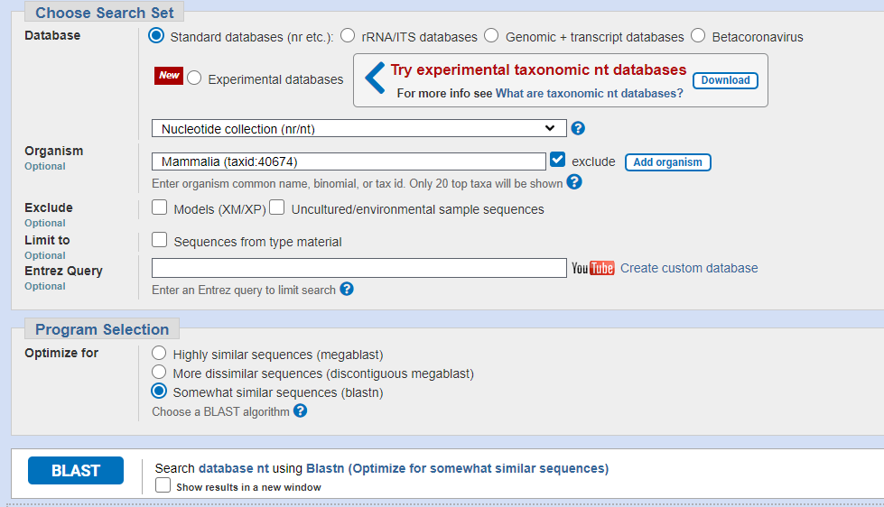
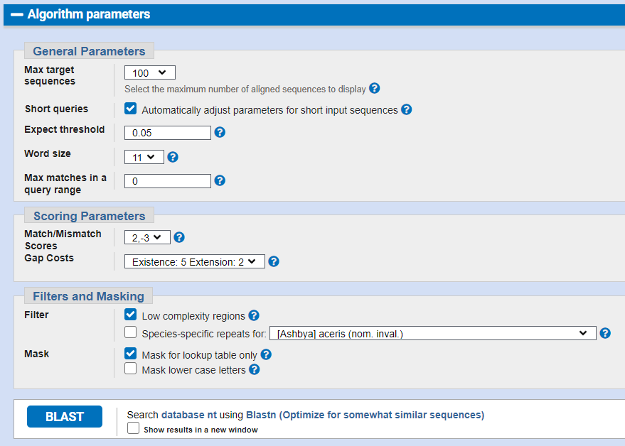

# Задание 2
1. [Разминочные вопросы](#разминочные-вопросы)
2. [Название выбранного гена](#название-выбранного-гена)
3. [Параметры BLAST](#параметры-blast)
4. [Таблица гомологичных генов](#таблица-гомологичных-генов)
5. [Файл множественного выравнивания](#файл-множественного-выравнивания)
6. [Анализ консервативности](#анализ-консервативности)
7. [Название объединяющего таксона](#название-объединяющего-таксона)

## Разминочные вопросы:

1. Какой ближайший таксон объединяет:
    - человека и мышь? 

        **Ответ**: подкласс плацентарные ([Placental Mammals](http://tolweb.org/Eutheria/15997))

    - человека и бабочку?

        **Ответ**: таксон Двусторонне-симметричные (или билатеральные, или билатерии) ([Bilateria](http://tolweb.org/Bilateria/2459))

    - человека и дрожжи?

        **Ответ**: домен Эукариоты ([Eukaryotes](http://tolweb.org/Eukaryotes/3))

    - человека и капусту?

        **Ответ**: домен Эукариоты ([Eukaryotes](http://tolweb.org/Eukaryotes/3))

2. Согласно схеме http://tolweb.org/Eukaryotes/3, какой из организмов
является ближайшим к человеку, а какой самым удаленным от человека:
    - эвглена зеленая,
    - фитофтора,
    - ламинария сахаристая,
    - дизентерийная амеба?

    **Ответ**: самая ближайшая - это дизентерийная амеба, а все остальные одинакова удалены от человека. 
    
    (эвглена зеленая - Euglenozoa, фитофтора - Stramenopiles, ламинария сахаристая - Stramenopiles, дизентерийная амеба - Amoebozoa)

## Название выбранного гена

HOXA13 homeobox A13 [ Homo sapiens (human) ]

https://www.ncbi.nlm.nih.gov/gene/3209/

## Параметры BLAST
Database: Standard databases (nr etc.)

Nucleotide collection (nr/nt)

Organism: all organisms exclude Mamallia (taxid:40674)

Algorithm: blastn

## Таблица гомологичных генов

| |Gene Symbol|Систематическое название|Русское название|
|-|-----------|--------------------|--------------------|
|1| HOXA13    | Eublepharis macularius | Пятнистый эублефар |
|2| HOXA13  | Alligator mississippiensis | Миссисипский аллигатор |
|3| HOXA13 | Dromaius novaehollandiae | Чёрный эму |
|4| HOXA13 | Crocodylus porosus | Гребнистый крокодил |
|5| HOXA13 | Aquila chrysaetos | Беркут |
|6| HOXA13 | Gavia stellata | Краснозобая гагара |
|7| HOXA13 | Harpia harpyja | Южноамериканская гарпия |
|8| HOXA13 | Cygnus atratus | Чёрный лебедь |
|9| HOXA13 | Accipiter gentilis | Ястреб-тетеревятник |
|10| HOXA13 | Haliaeetus leucocephalus  | Белоголовый орлан |

## Файл множественного выравнивания

[clustalo_aln.aln](clustalo_aln.aln)

## Анализ консервативности

Длина всего выравнивания 2893 символа. Из них 777 абсолютно консервативны.
Что составляет $\approx 27\% $. 

## Название объединяющего таксона

Объединяющий таксон - амниоты (Amniota). 

Амниоты - клада четвероногих, характеризующаяся наличием зародышевых оболочек.
