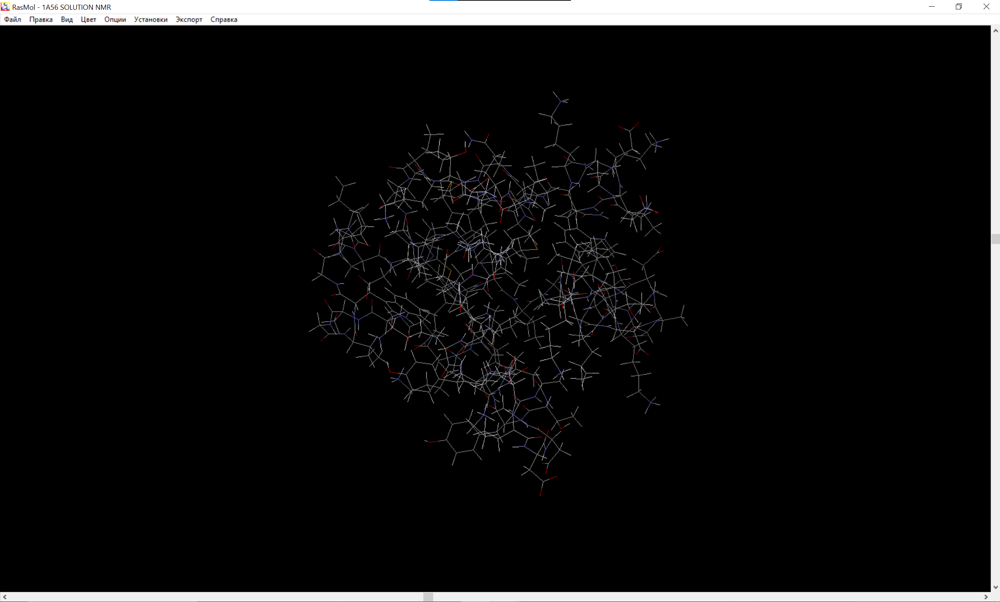
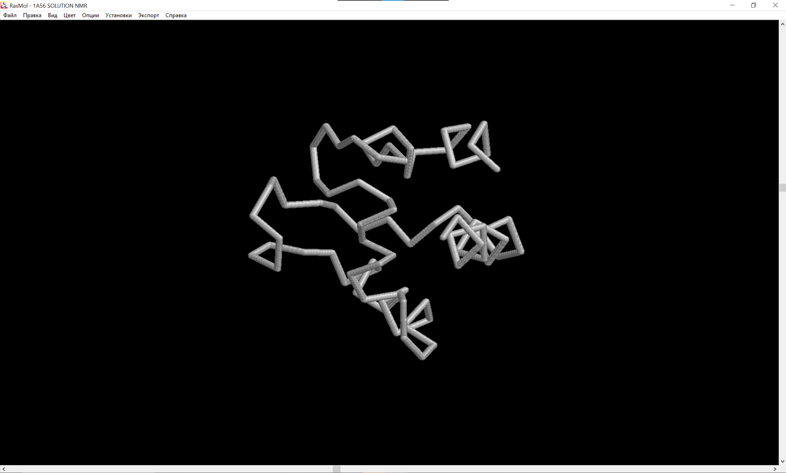
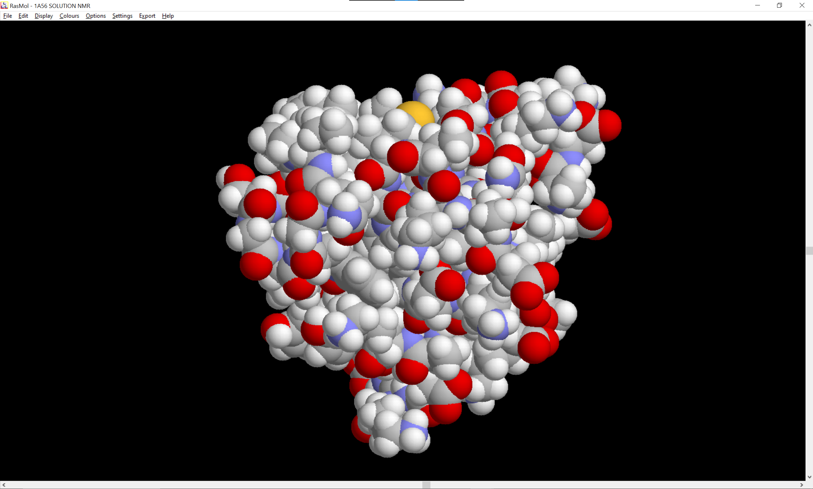
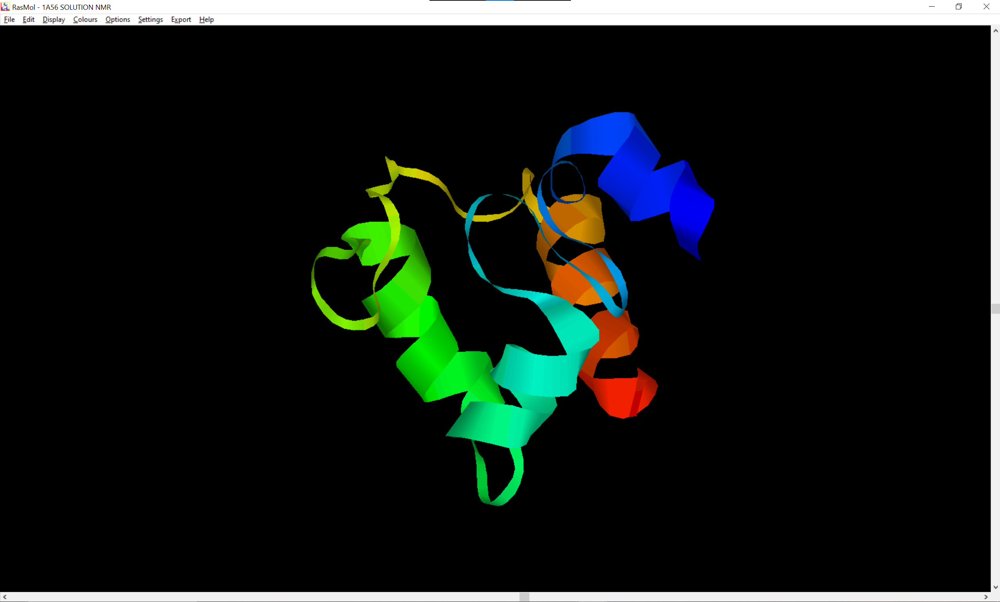
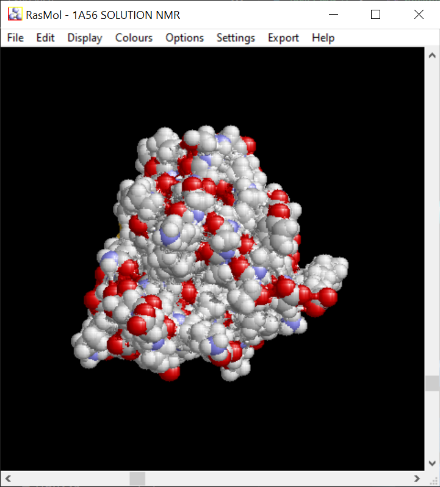
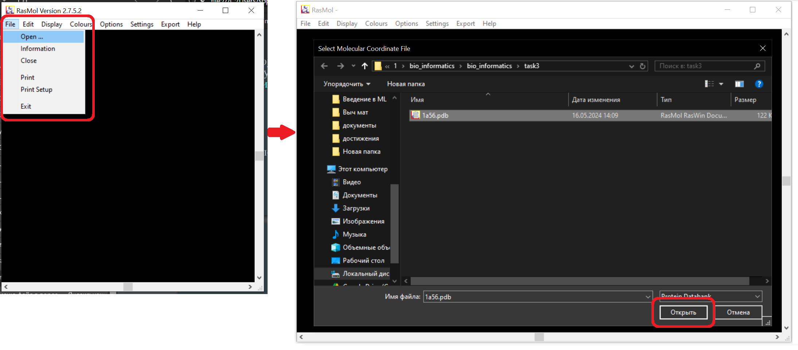
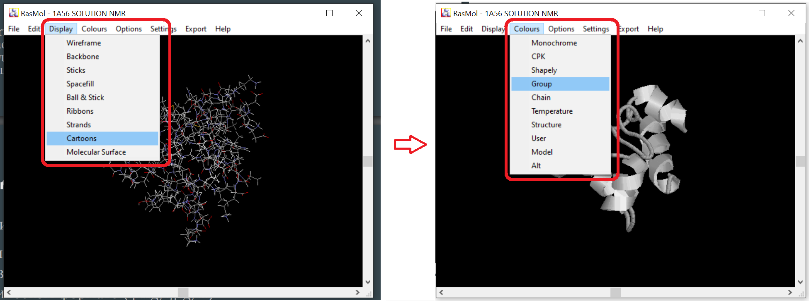
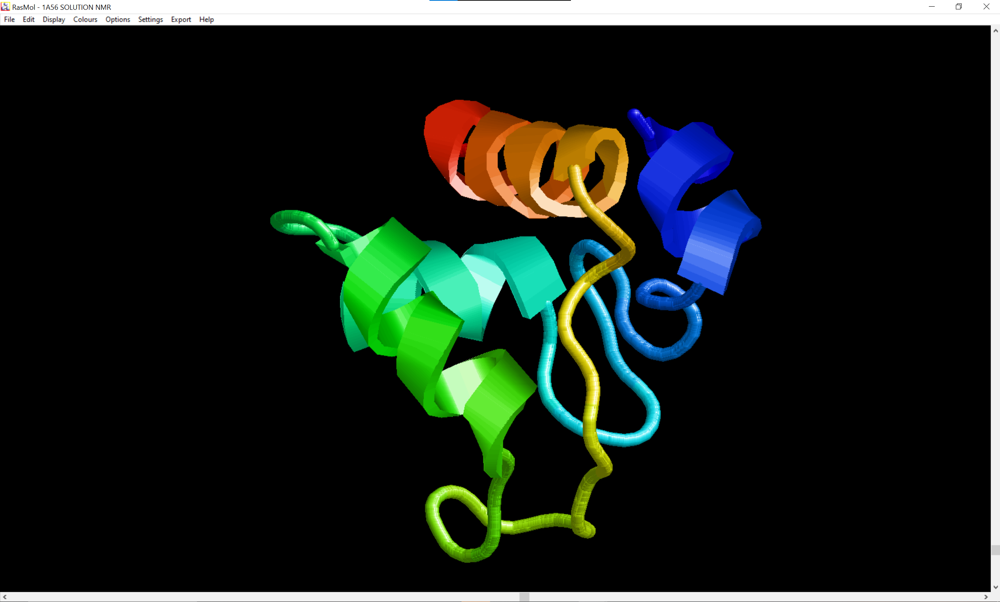

# Задание 3
1. [Название ПО и ссылка на выбранную структуру белка](#название-по-и-ссылка-на-выбранную-структуру-белка)
2. [Полученные изображения белка](#полученные-изображения-белка)
3. [Описание способа получения визуализации](#описание-способа-получения-визуализации)
4. [Изображение публикационного качества](#изображение-публикационного-качества)

## Название ПО и ссылка на выбранную структуру белка:
ПО - RasMol. Cсылка: [http://www.openrasmol.org](http://www.openrasmol.org).

Белок - ferrocytochrome c-552 (id: 1A56). Ссылка: [https://www.rcsb.org/structure/1A56](https://www.rcsb.org/structure/1A56)

## Полученные изображения белка

1. Wireframe
    
2. Backbone
    
3. Spacefill
    
4. Ribbons
    
5. Molecular surface
    

## Описание способа получения визуализации

При запуске программы создается два окна. Одно с полотном на котором визуализируется молекула. Второе с коммандной строкой через которую можно управлять визуализацией.

Если после установки язык интерфейса Русский, то при помощи комманды `english` в окне с коммандной строкой, язык можно поменять на английский.

В левом верхнем углу выбираем меню File -> Open ... . Выбираем в проводнике файл с нужной нам молекулой.

В меню Display можно выбрать нужное нам представление. В меню Colours можно выбрать вариант расскраски.

При помощи комбинации клавиши Left Shift + Left Mouse и движения мыши вверх/вниз можно приближать/отдалять картинку.

## Изображение публикационного качества
