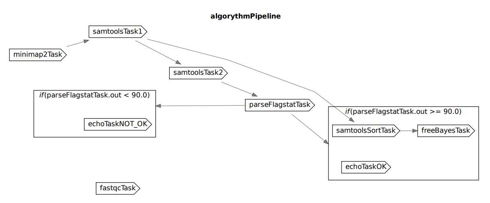

# Задание 4

## 1. Ссылка на загруженные прочтения из NCBI SRA
[https://www.ncbi.nlm.nih.gov/sra/ERX11873213[accn]](https://www.ncbi.nlm.nih.gov/sra/ERX11873213[accn])

## 2. Скрипт на bash с реализованным алгоритмом
[algorythm.sh](algorythm.sh)

Пример использования:
```bash
./algorythm hg38.fa ERR12497130.fastq
```

## 3. Результат команды samtools flagstat
[ERR12497130_rating.txt](ERR12497130_rating.txt)

```
9781 + 0 in total (QC-passed reads + QC-failed reads)
2110 + 0 secondary
3680 + 0 supplementary
0 + 0 duplicates
9772 + 0 mapped (99.91% : N/A)
0 + 0 paired in sequencing
0 + 0 read1
0 + 0 read2
0 + 0 properly paired (N/A : N/A)
0 + 0 with itself and mate mapped
0 + 0 singletons (N/A : N/A)
0 + 0 with mate mapped to a different chr
0 + 0 with mate mapped to a different chr (mapQ>=5)

```

## 4. Скрипт разбора файлов с этими результатами

[parsing_scrypt.sh](parsing_scrypt.sh)

## 5. *Опционально файлы FASTQ, SAM/BAM, VCF в архивах

Все файлы в архиве [punkt5.zip](punkt5.zip)

## 6. Инструкцию по развертыванию и установке фреймворка

Для исполнения будем пользоваться движком [Cromwell](https://github.com/broadinstitute/cromwell).

Для его работы нужна Java. Команда для проверки, что Java установлена

```bash
java -version
```

Заходим на [страницу релизов](https://github.com/broadinstitute/cromwell/releases) Cromwell. В списке Assets находим файл `cromwell-XX.jar` и скачиваем. На текущий момент последняя версия была [cromwell-87.jar](https://github.com/broadinstitute/cromwell/releases/download/87/cromwell-87.jar).

Чтобы запустить:

```bash
java -jar cromwell-87.jar run myWorkflow.wdl --inputs myWorkflow_inputs.json
```

## 7. Код любого тестового пайплайна (“Hello world”) на фреймворке
Файл [hello.wdl](hello.wdl)

Запуск

```bash
java -jar cromwell-87.jar run hello.wdl 
```

## 8. Результаты работы пайплайна на фреймворке и лог-файлы

Пайплайн генерирует директорию [cromwell-executions\HelloWorld\f055c86e-7fd2-4c09-bd2d-6dd4ef5e1ac7](cromwell-executions\HelloWorld\f055c86e-7fd2-4c09-bd2d-6dd4ef5e1ac7). 

Результат работы файл [stdout](cromwell-executions\HelloWorld\f055c86e-7fd2-4c09-bd2d-6dd4ef5e1ac7\call-WriteGreeting\execution\stdout) .

Лог-файл: [hello.wdl.log](cromwell-workflow-logs\hello.wdl.log) .

## 9. *Опционально описание использованных инструментов для визуального создания пайплайнов (скриншоты)

SKIP

## 10. Код пайплайна “оценки качества картирования” на фреймворке

Код пайплайна: [algorythmPipeline.wdl](algorythmPipeline.wdl) .

## 11. Выведенные результаты работы пайплайна на загруженных данных в отдельном файле

Пайплайн генерирует директорию [cromwell-executions\algorythmPipeline\b86770af-6316-4e1c-a581-4d6a30dc50a9](cromwell-executions\algorythmPipeline\b86770af-6316-4e1c-a581-4d6a30dc50a9). Откуда были убраны самые большие файлы.

Результат работы файл [stdout](cromwell-executions\algorythmPipeline\b86770af-6316-4e1c-a581-4d6a30dc50a9\call-echoTaskOK\execution\stdout) .

## 12. Лог-файлы работы пайплайна на загруженных данных

Лог-файл: [algorythmPipeline.wdl.log](cromwell-workflow-logs\algorythmPipeline.wdl.log) .

## 13. Визуализацию пайплайна в виде графического файла



## 14. Описание использованного способа визуализации и отличия полученной визуализации от блок-схемы алгоритма в свободной форме

Визуализировала при помощи чужого скрипта на python: [wdlviz](https://github.com/miniwdl-ext/wdlviz).

Задача с minimap2 не зависит от FastQC, поэтому выходит одна независимая задача c репортом от FatsQC и весь дальнейший пайплайн с расчетами. Расчеты alignment и индексирование референса были одной задачей. Остальное выглядит похоже, только появилось несколько новых стрелочек про использование результатов прошлых шагов.