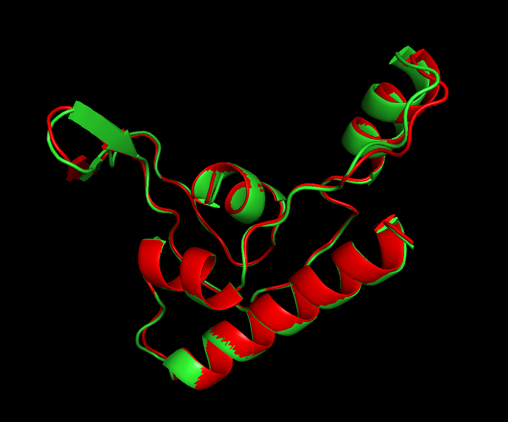
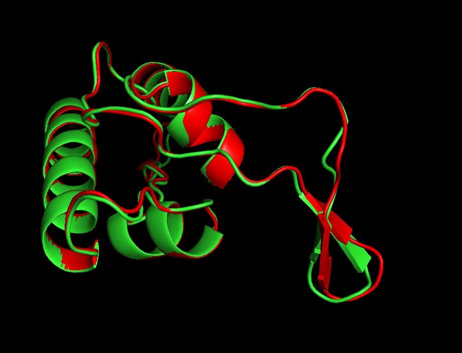

# Задание 5

## 1. Последовательность, название программ-предсказателей и программы-выравнивателя

Последовательность: MVEYFGQNLNGFLFTKNAWVQSYGTRCVKPPIVWGDVSRANPITVEWSAYAQSKTDHVMKGMLTGPVTILNWSWPREDITHEEQTKQLALAIRDEVLDLE

Программы-предсказатели: RoseTTAFold2 и OpenFold

Программа-выравниватель: jCE (в списке Alignment Method), [https://www.rcsb.org/alignment](https://www.rcsb.org/alignment)

## 2. Ноутбуки с предсказанной структурой

OpenFold: [OpenFold.ipynb](OpenFold.ipynb)

RoseTTAFold2: [RoseTTAFold2.ipynb](RoseTTAFold2.ipynb)

## 3. Предсказания структур в формате PDB

OpenFold: [OpenFold_pred.pdb](OpenFold_pred.pdb)

RoseTTAFold2: [RoseTTAFold2_pred.pdb](RoseTTAFold2_pred.pdb)

## 4. Полная выдача программы выравнивания 

Полная выдача программы находится в папке [Alignment_res](Alignment_res).

Там также находится скриншот с табличкой:

## 5. Сессия из PyMOL

Файл: [vis_session.pse](vis_session.pse)

## Скриншоты из PyMOL

## Выводы о совпадении полученных предсказаний

Предсказания очень сильно совпадают, что видно по скриншотам визуализации.